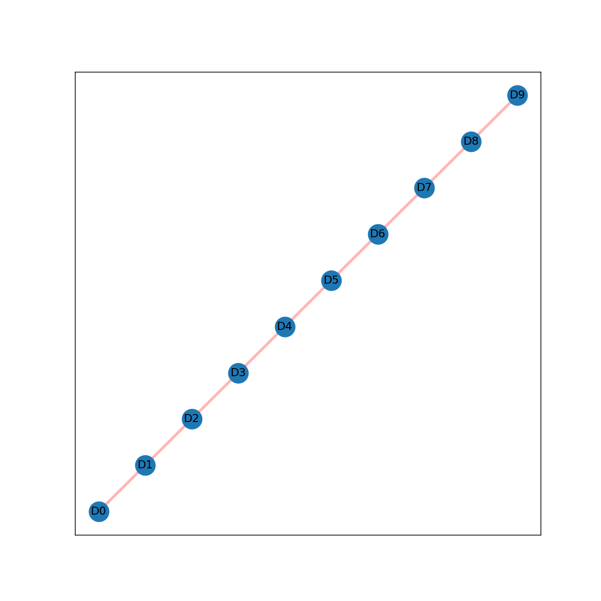
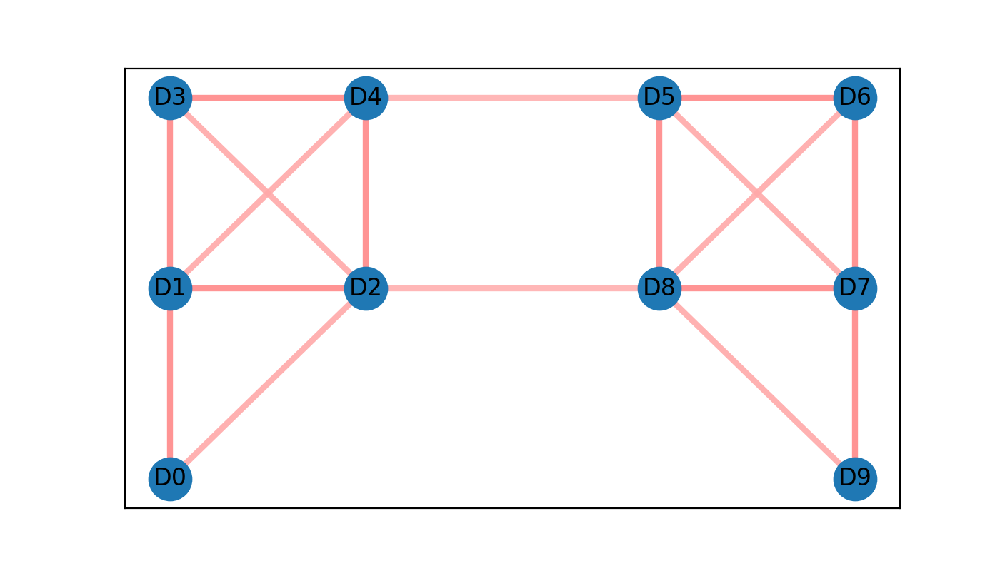
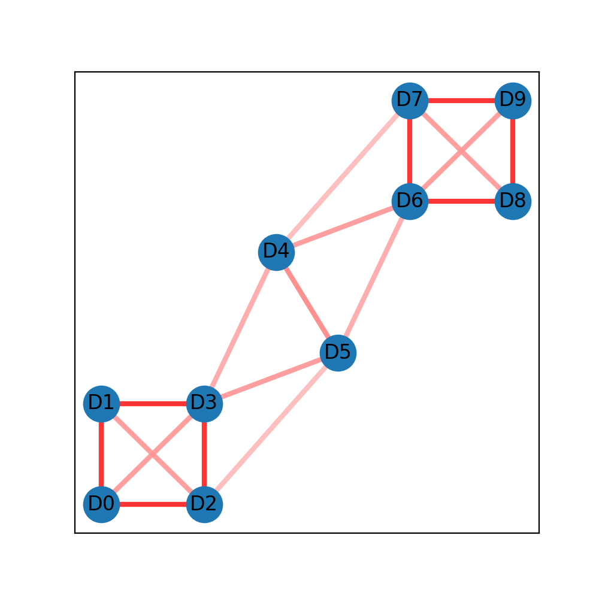

# Bluetooth Mesh Network Simulation

This test demonstration shows how Babblsim test framework can be used for simulating Bluetooth Mesh networks. It allows testing different network topologies and evaluating mesh network functioning. The network topology itself is modeled by [NxN attenuation channel model](https://github.com/BabbleSim/ext_2G4_channel_multiatt) for configuring attenuation of each independent path between the nodes.

The attenuation for each path is provided by attenuation coefficients in the `.coeff` file. This demonstration also provides a script to create the attenuation coefficients and visualize the network topology.

## Test Organization

The test suite consists of several key components:

1. **Source Files**
   - `mesh_test.c`: Utilities and initialization functions
   - `mesh_nw_test.c`: Implementation of device and tester node behaviors
   - `test_scripts/test_nw_sim.sh`: Test execution script. This script contains various scenarios that you can run the test with

2. **Network Configuration**
   - Custom topology definitions via node coordinates
   - Attenuation patterns between nodes stored in `.coeff` files
   - Visual network graphs generated as `.png` files, showing node positions and radio range connectivity. Nodes which are not in radio range are not shown as connected in the picture.

3. **Test Procedure**
   - Uses last instiated node as a tester and uses all nodes (including tester) as devices under test.
   - Tester starts with the first device.
     - Tester sends the [Health_Attention_Get](https://www.bluetooth.com/specifications/specs/html/?src=MshPRT_v1.1/out/en/index-en.html#UUID-fcfa6fca-6f36-ff67-fa0a-202ba5cd1622) message, and waits for response.
       - Note: Health client API is used in a synchronous (blocking) way, and therefore API waits until a response is received from the device.
     - Tester measures the time it took to receive a response message
     - If timeout occurs, error is recorded.
     - Procedure is repeated for `MAX_ITERATIONS` number of times.
   - Tester moves to next device and repeats above steps.
   - At the end, latency results are printed.

## Building and Running the Test

1. Check out v3.0.1 tag for nRF Connect SDK:
   ```bash
   cd /ncs/nrf
   git checkout v3.0.1
   west update
   ```

2. Clone this sample demonstration at `/ncs/zephyr` root directory
   ```bash
   cd /ncs/zephyr
   git clone https://github.com/omkar3141/demo_mesh_nw_sim
   ```

3. Compile and run the test:
   ```bash
   cd /ncs/zephyr/demo_mesh_nw_sim
   ./compile.sh
   ./test_scripts/test_nw_sim.sh
   ```

4. Test will run with example topology 1, and will print the results to the console. You can change the topology by modifying the `test_scripts/test_nw_sim.sh` script. The script contains several scenarios that you can run the test with. Each scenario is defined by a different network topology.

Output will look like this:
```bash
d_09: @00:02:04.858796  [00:02:04.858,795] <inf> mesh_nw_test: Tester (0x000a) and each of the devices exchanged 10 messages
d_09: @00:02:04.858796  [00:02:04.858,795] <inf> mesh_nw_test: Average round-trip latency for acknowledged messages:
d_09: @00:02:04.858796  [00:02:04.858,795] <inf> mesh_nw_test: Dev 0 addr 0x0001 avg latency:  83 ms failures 0
d_09: @00:02:04.858796  [00:02:04.858,795] <inf> mesh_nw_test: Dev 1 addr 0x0002 avg latency:  83 ms failures 0
d_09: @00:02:04.858796  [00:02:04.858,795] <inf> mesh_nw_test: Dev 2 addr 0x0003 avg latency:  81 ms failures 0
d_09: @00:02:04.858796  [00:02:04.858,795] <inf> mesh_nw_test: Dev 3 addr 0x0004 avg latency:  68 ms failures 0
d_09: @00:02:04.858796  [00:02:04.858,795] <inf> mesh_nw_test: Dev 4 addr 0x0005 avg latency:  53 ms failures 0
d_09: @00:02:04.858796  [00:02:04.858,795] <inf> mesh_nw_test: Dev 5 addr 0x0006 avg latency:  44 ms failures 0
d_09: @00:02:04.858796  [00:02:04.858,795] <inf> mesh_nw_test: Dev 6 addr 0x0007 avg latency:  32 ms failures 0
d_09: @00:02:04.858796  [00:02:04.858,795] <inf> mesh_nw_test: Dev 7 addr 0x0008 avg latency:  24 ms failures 0
d_09: @00:02:04.858796  [00:02:04.858,795] <inf> mesh_nw_test: Dev 8 addr 0x0009 avg latency:   6 ms failures 0
d_09: @00:02:04.858796  [00:02:04.858,795] <inf> mesh_nw_test: Dev 9 addr 0x000a avg latency:   0 ms failures 0
d_09: @00:02:04.858796 INFO: test_node_tester PASSED
```

## Creating Network Topologies

### Network Topology Creation

Use the `helper_nw_att_file_creator.py` script to create new network topologies.

1. Define node positions
   Edit the script and define node coordinates. Examples:
   ```python
   # Linear chain topology
   nodes = [(0, 0), (1, 1), (2, 2), (3, 3), (4, 4), (5, 5), (6, 6), (7, 7), (8, 8), (9, 9)]
   ```

2. Provide the file name in `fname` variable:
   ```python
   fname = "network1"  # Output filename
   ```

3. Provide the connectivity radius. This radius defines the maximum distance between nodes for them to be considered within the radio range. The script will linearly scale the attenuation (from 0 to `max_att_for_conn_radius`) against the distance between the nodes. Beyond this radius the attenuation will be set to 195 dBm, which effectively isolates the nodes.
   ```python
   connectivity_radius = 1.7  # Maximum connection distance
   ```

4. Provide the maximum attenuation for nodes within the connectivity radius:
   ```python
   max_att_for_conn_radius = 95  # Maximum attenuation for connected nodes
   ```

5. Generate network representation and attenuation coefficients file:
   ```bash
   python3 helper_nw_att_file_creator.py
   ```
   This creates:
   - `network1_att_file.coeff`: Attenuation coefficients
   - `network1.png`: Visual network diagram

6. Update your test script to use the generated topology:
   ```bash
   RunTest arg_ch=multiatt arg_file=$NW_CONFIG_DIR/network1_att_file.coeff mesh_nw_sim_test \
               node_device \
               node_device \
               ... (add more nodes as needed) \
               node_tester
   ```

### Examples Topologies:

1. Example 1 - Linear chain topology
   ```python
   nodes = [(0, 0), (1, 1), (2, 2), (3, 3), (4, 4), (5, 5), (6, 6), (7, 7), (8, 8), (9, 9)]
   fname = "network1"
   connectivity_radius = 1.7
   max_att_for_conn_radius = 95
   ```

   Results in following topology:

   

2. Example 2
   ```python
   nodes = [(0, 0), (0, 2), (2, 2), (0, 4), (2, 4), (5, 4), (7, 4), (7, 2), (5, 2), (7, 0)]
   fname = "network2"
   connectivity_radius = 3.6
   max_att_for_conn_radius = 95
   ```

   Results in following topology:

   

3. Example 3
   ```python
   nodes = [(0, 0), (0, 1), (1, 0), (1, 1), (1.7, 2.5), (2.3, 1.5), (3, 3), (3, 4), (4, 3), (4, 4)]
   fname = "network3"
   connectivity_radius = 2.2
   max_att_for_conn_radius = 95
   ```

   Results in following topology:

   


## Further exploration

You can build your own testing scenarios for specific applications and specific use-cases with this
approch. It is recommended to test one specific thing at a time to keep test code simpler. However,
you can construct as complex test as you want.

Refer to existing [Bluetooth Mesh Babblesim tests](https://github.com/zephyrproject-rtos/zephyr/tree/main/tests/bsim/bluetooth/mesh) for more inspiration. The existing tests are not
based on network topology, and they assume all devices can communicate with all other devices.

## Limitations

This networking simulation demonstration uses Zephyr's link layer for simplicity. Currently, it is not possible to use SoftDevice controller for Babblesim simulation.
However, as Bluetooth Mesh operates at higher protocol layer above the controller, such simulation can be a great tool to understand functioning of Bluetooth Mesh networking.

### Important Notes

- The simulation provides consistent, reproducible results with every execution. Even the "random" behavior in the mesh stack and controller's advertising bearer will produce identical outcomes across multiple runs.
- Combining this simulation with physical device testing provides a comprehensive validation approach, significantly enhancing the reliability of your application development process.
- When analyzing mesh message delivery to target nodes, use Unacknowledged Messages rather than Acknowledged Messages (which require responses). This approach provides clearer visibility into the message delivery process itself.
- For applications that require robustness of message exchange, you can implement custom application-level retry mechanisms to achieve complete reliability tailored to your specific use-cases.
