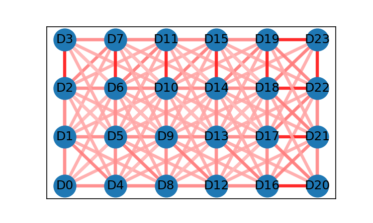
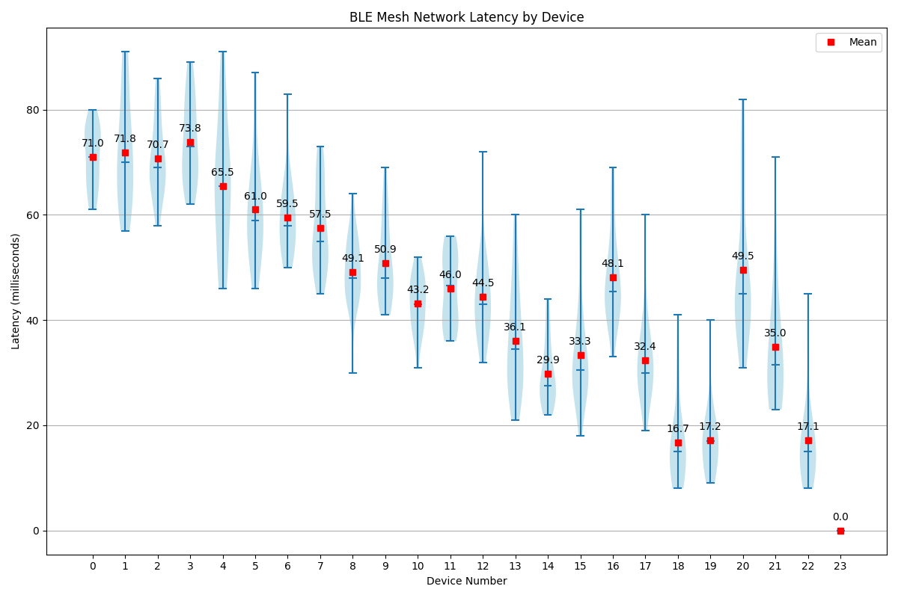
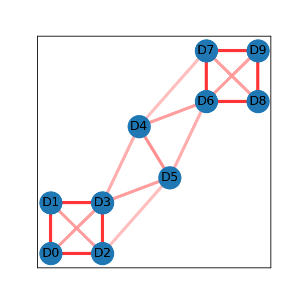
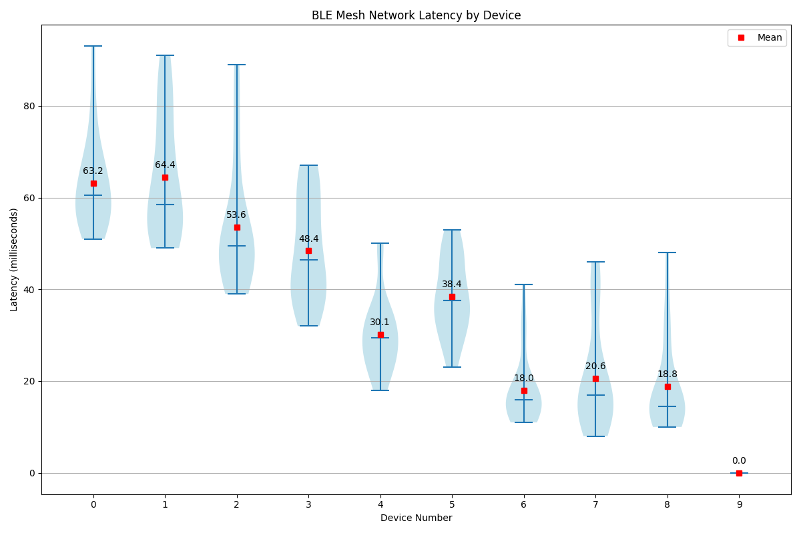

# Bluetooth Mesh Network Simulation

This test demonstration shows how Babblsim test framework can be used for simulating Bluetooth Mesh networks. It allows testing different network topologies and evaluating mesh network functioning. The network topology itself is modeled by [NxN attenuation channel model](https://github.com/BabbleSim/ext_2G4_channel_multiatt) for configuring attenuation of each independent path between the nodes. The [BLE Simple modem](https://github.com/BabbleSim/ext_2G4_modem_BLE_simple/blob/master/docs/Description.pdf) is necessary for this test. This modem allows modelling of packet loss due to weak signals, basically isolating all the nodes which have high attenuation between them.

The attenuation for each path is provided by attenuation coefficients in the `.coeff` file. This demonstration also provides a script to create the attenuation coefficients and visualize the network topology.

## Test Organization

The test suite consists of several key components:

1. **Source Files**
   - `mesh_test.c`: Utilities and initialization functions
   - `mesh_nw_test.c`: Implementation of device and tester node behaviors
   - `mesh_nw_test_vnd_mdl.c`: Testing using vendor models
   - `test_scripts/test_network1.sh`: Test execution script for network topology 1. This script is provided as an example of how to run the test with a specific topology.
   - `test_scripts/test_1tester_ndevs_generic.sh`: Test execution script. This is a generic script that can be used to run the test with any number of devices and any topology. It takes the number of devices, the attenuation coefficients file, and the number of iterations as arguments.
   - `test_scripts/test_1_tester_n_dev_generic_vnd_mdl.sh`: Test execution script for testing using vendor models.

2. **Network Configuration**
   - Custom topology definitions via node coordinates
   - Attenuation patterns between nodes stored in `.coeff` files
   - Visual network graphs generated as `.png` files, showing node positions and radio range connectivity. Nodes which are not in radio range are not shown as connected in the picture.

3. **Test Procedure**
   - Uses last instiated node as a tester and uses all nodes (including tester) as devices under test.
   - Tester starts with the first device.
     - Tester sends the [Health_Attention_Get](https://www.bluetooth.com/specifications/specs/html/?src=MshPRT_v1.1/out/en/index-en.html#UUID-fcfa6fca-6f36-ff67-fa0a-202ba5cd1622) message, and waits for response.
       - Note: Health client API is used in a synchronous (blocking) way, and therefore API waits until a response is received from the device.
     - Tester measures the time it took to receive a response message
     - If timeout occurs, error is recorded.
     - Procedure is repeated for `MAX_ITERATIONS` number of times.
   - Tester moves to next device and repeats above steps.
   - At the end, latency results are printed.

## Building and Running the Test

1. Check out main branch for nRF Connect SDK:
   ```bash
   cd /ncs/nrf
   git checkout main
   west update
   ```

2. Clone this sample demonstration at `/ncs/zephyr` root directory
   ```bash
   cd /ncs/zephyr
   git clone https://github.com/omkar3141/demo_mesh_nw_sim
   ```

3. Compile and run the test. For example: To run the test with 10 devices, 20 message Get/Status transactions per device, and using the topology 1:
   ```bash
   cd /ncs/zephyr/demo_mesh_nw_sim
   ./compile.sh
   ./test_scripts/test_1tester_ndevs_generic.sh -n 10 -c network1_att_file.coeff -i 20
   ```

   Alternatively, you can also use `test_network1.sh` script to run the test with 10 devices and default number of iterations for topology 1:
   ```bash
   ./test_scripts/test_network1.sh
   ```

4. Test will run with example topology 1, and will print the results to the console.

Output will look like this:
```bash
d_09: @00:04:16.049439  [00:04:16.049,438] <inf> mesh_nw_test: Dev 0 addr 0x0001 avg latency: 159 ms failures 0 # values: 161 139 134 145 164 171 154 180 161 183 210 192 131 138 179 152 143 171 151 126
d_09: @00:04:16.049439  [00:04:16.049,438] <inf> mesh_nw_test: Dev 1 addr 0x0002 avg latency: 142 ms failures 0 # values: 168 160 160 131 149 134 135 135 145 119 140 153 137 132 168 121 115 201 119 131
d_09: @00:04:16.049439  [00:04:16.049,438] <inf> mesh_nw_test: Dev 2 addr 0x0003 avg latency: 123 ms failures 0 # values: 147 102 109 97 117 145 120 141 135 116 136 117 126 126 142 111 130 110 133 104
d_09: @00:04:16.049439  [00:04:16.049,438] <inf> mesh_nw_test: Dev 3 addr 0x0004 avg latency: 100 ms failures 0 # values: 98 94 100 89 94 109 101 113 95 100 87 91 142 84 97 98 83 125 117 91
d_09: @00:04:16.049439  [00:04:16.049,438] <inf> mesh_nw_test: Dev 4 addr 0x0005 avg latency:  88 ms failures 0 # values: 92 93 75 99 95 81 61 73 66 92 104 104 107 76 100 86 71 88 99 104
d_09: @00:04:16.049439  [00:04:16.049,438] <inf> mesh_nw_test: Dev 5 addr 0x0006 avg latency:  75 ms failures 0 # values: 62 102 63 73 115 54 67 66 77 107 80 58 77 65 67 125 57 54 82 68
d_09: @00:04:16.049439  [00:04:16.049,438] <inf> mesh_nw_test: Dev 6 addr 0x0007 avg latency:  55 ms failures 0 # values: 37 55 56 73 75 43 89 39 79 47 45 43 42 94 48 50 49 39 55 53
d_09: @00:04:16.049439  [00:04:16.049,438] <inf> mesh_nw_test: Dev 7 addr 0x0008 avg latency:  38 ms failures 0 # values: 61 28 29 42 56 25 64 40 23 35 34 33 37 48 32 27 43 28 32 43
d_09: @00:04:16.049439  [00:04:16.049,438] <inf> mesh_nw_test: Dev 8 addr 0x0009 avg latency:  15 ms failures 0 # values: 17 17 14 14 12 15 15 17 10 15 15 13 23 17 16 19 13 14 17 11
d_09: @00:04:16.049439  [00:04:16.049,438] <inf> mesh_nw_test: Dev 9 addr 0x000a avg latency:   0 ms failures 0 # values: 0 0 0 0 0 0 0 0 0 0 0 0 0 0 0 0 0 0 0 0
```

5. You can then visualize the test results by pasting the output in the helper script `helper_plot_results.py` and running it:
   ```bash
   python3 helper_plot_results.py
   ```

## Creating Network Topologies

### Network Topology Creation

Use the `helper_nw_att_file_creator.py` script to create new network topologies.

1. Define node positions
   Edit the script and define node coordinates. Examples:
   ```python
   # Linear chain topology
   nodes = [(0, 0), (1, 1), (2, 2), (3, 3), (4, 4), (5, 5), (6, 6), (7, 7), (8, 8), (9, 9)]
   ```

2. Provide the file name in `fname` variable:
   ```python
   fname = "network1"  # Output filename
   ```

3. Provide the connectivity radius. This radius defines the maximum distance between nodes for them to be considered within the radio range. The script will linearly scale the attenuation (from 0 to `max_att_for_conn_radius`) against the distance between the nodes. Beyond this radius the attenuation will be set to 195 dBm, which effectively isolates the nodes.
   ```python
   connectivity_radius = 1.7  # Maximum connection distance
   ```

4. Provide the maximum attenuation for nodes within the connectivity radius:
   ```python
   max_att_for_conn_radius = 95  # Maximum attenuation for connected nodes
   ```

5. Generate network representation and attenuation coefficients file:
   ```bash
   python3 helper_nw_att_file_creator.py
   ```
   This creates:
   - `network1_att_file.coeff`: Attenuation coefficients
   - `network1.png`: Visual network diagram

6. Use `test_1_tester_n_dev_generic.sh` script to use the generated topology and run the test. The script takes the number of devices and the attenuation coefficients file as arguments. For example, to run the test with 10 devices using the generated coefficients file:
   ```bash
   ./test_scripts/test_1_tester_n_dev_generic.sh -n 10 -c network1_att_file.coeff
   ```

### Examples Topologies:

1. Example 1 - Linear chain topology
   ```python
   nodes = [(0, 0), (1, 1), (2, 2), (3, 3), (4, 4), (5, 5), (6, 6), (7, 7), (8, 8), (9, 9)]
   fname = "network1"
   connectivity_radius = 1.7
   max_att_for_conn_radius = 95
   ```

   Results in following topology:

   

   If you plot the results using `helper_plot_results.py`, the output violin plot will show the average round-trip latency for each device in the network. The x-axis will represent the device addresses, and the y-axis will represent the average latency in milliseconds. The plot will show the distribution of latencies for each device, allowing you to visualize the performance of the mesh network under the defined topology.

   The violin plot for this topology, with 20 messages exchanged for each node, looks like this:

   

2. Example 2
   ```python
   nodes = []
   for i in range(6):
       for j in range(4):
           nodes.append((i, j))
   fname = "network2"
   connectivity_radius = 1.7
   ```

   Results in following topology:

   

   The violin plot for this topology, with 20 messages exchanged for each node, looks like this:

   

3. Example 3
   ```python
   nodes = [(0, 0), (0, 1), (1, 0), (1, 1), (1.7, 2.5), (2.3, 1.5), (3, 3), (3, 4), (4, 3), (4, 4)]
   fname = "network3"
   connectivity_radius = 2.2
   max_att_for_conn_radius = 95
   ```

   Results in following topology:

   

   The violin plot for this topology, with 20 messages exchanged for each node, looks like this:

   


## Further exploration

You can build your own testing scenarios for specific applications and specific use-cases with this approch. It is recommended to test one specific thing at a time to keep test code simpler. However, you can construct as complex test as you want.

Refer to existing [Bluetooth Mesh Babblesim tests](https://github.com/zephyrproject-rtos/zephyr/tree/main/tests/bsim/bluetooth/mesh) for more inspiration. The existing tests are not
based on network topology, and they assume all devices can communicate with all other devices.


### Important Notes

- The simulation provides consistent, reproducible results with every execution. Even the "random" behavior in the mesh stack and controller's advertising bearer will produce identical outcomes across multiple runs.
- Combining this simulation with physical device testing provides a comprehensive validation approach, significantly enhancing the reliability of your application development process.
- When analyzing mesh message delivery to target nodes, use Unacknowledged Messages rather than Acknowledged Messages (which require responses). This approach provides clearer visibility into the message delivery process itself.
- For applications that require robustness of message exchange, you can implement custom application-level retry mechanisms to achieve complete reliability tailored to your specific use-cases.
